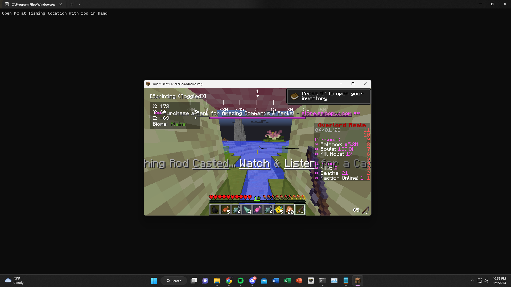
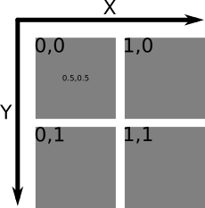

# FishBot

### Features
- Casts rod and reels rod in when fish is caught (v1)
- Avoids AFK kick by moving character and mouse position (v2)

### First time setup
- Make sure Python 3.x is installed
- Run `install.bat`
- See "Notes" section if the script does not initially work.

### To use
- Make sure game is full screen
- Go to fishing location
- Pull out rod
- Run `main.py`
- Go back to game

### To stop
- Hit ESC in game
- Go to CMD and hit CTRL+C

## Notes
This script works by detecting color changes of a pixel that is specific to fishing. The loop for fishing is shown in the code below.
```
while True: # While rod is casted
    px = g.grab().load() # Looks at screen
    color = px[956,608] # Gets color of pixel at position x=956, y=608

    if color != (255,255,255): # If pixel is not white
        print('Fish caught')
        break # Leave fishing loop
```
This is what the window should look like when the script is running properly:



If we zoom in, we can see that the cyan pixel indicates the pixel that is being detected. 


This pixel is white (`color == (255,255,255)`) when the rod is casted and is not white (`color != (255,255,255)`) when there is a fish caught. Therefore, we reel the rod in when the pixel is not white.

### Setting up pixel position (`pixel.py`)
Note that I have only tested this using Lunar Client on saicopvp.com. The pixel position may change with different computers, clients, or servers. To account for this, I have included a script (`pixel.py`) that will simulate the window that will be open when using the bot. It will take a screenshot of the window and ask for XY coordinates as input. This will display an image with a cyan pixel at the input position. As a general rule, start with `x = 956` and `y = 608` and see where the cyan pixel is. Adjust the coordinates according to the diagram below.



Once the cyan pixel is on white text, as shown in the zoomed in image above, enter `y` when prompted `good? (y/n)` and the script will automatically modify `main.py` to work with your setup.

### Limitations
- Depending on the server, the principle of detecting pixel color changes may not work. 
